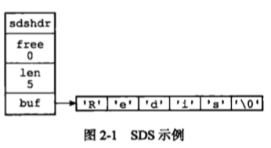

# 一. 简单动态字符串

* Redis  构建了一种名为简单动态字符串 (simple dynamic string, SDS) 的抽象类型，并将 SDS 用做 Redis 的默认字符串表示
* 除了用来保存数据库中的字符串值之外，SDS 还被用作缓冲区: AOF 模块中的 AOF 缓冲区: AOF 模块中的 AOF 缓冲区，以及客户端状态中的输入缓冲区，都是由 SDS 实现的。

## 1. SDS 的定义

* 每个 sds.h / sdshdr 结构表示一个 SDS 值

```c
struct sdshdr {
  
  // 记录 buf 数组中已使用字节的数量
  // 等于 SDS 所保存字符串的长度
  int len;
  // 记录 buf 数组中未使用字节的数量
  int free;
 	// 字节数组，用于保存字符串
  char buf[];
}
```



* free 属性的值为 0，表示这个 SDS 没有分配任何未使用空间
* len 属性的值为 5，表示这个 SDS 保存了一个 5 字节长的字符串
* buf 属性是一个 char 类型的数组，数组的前 5 个字节分别保存了 'R'、'e'、'd'、'i'、's' 5 个字符，而最后一个字节则保存了空字符 '\0'

## 2. SDS 与 C 字符串的区别

### 2.1 常数发咋读获取字符串长度

### 2.2 杜绝缓冲区溢出

### 2.3 减少修改字符串带来的内存重分配次数

### 2.4 二进制安全

### 2.5 兼容部分 C 字符串函数


## 3. SDS API 

